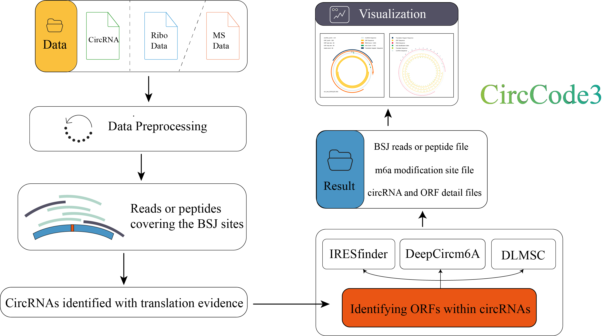
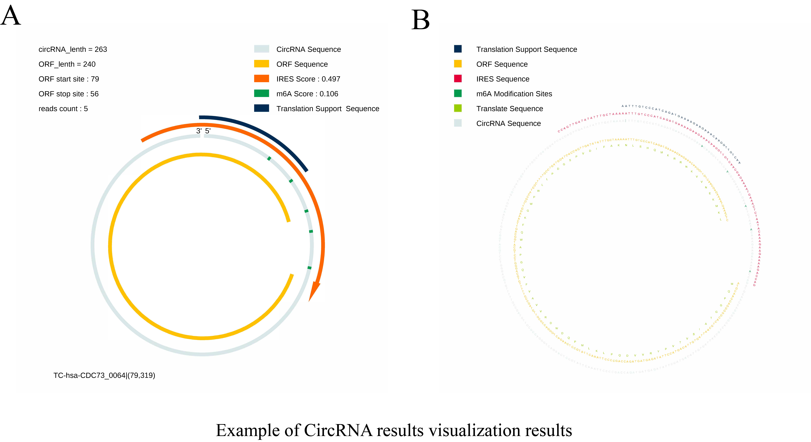

# CircCode3

CircCode3 is a Python3-base pipeline for the prediction and visualization of circRNA and ORF.

## Introduction

CircCode3 is a software that looks for evidence of targeted circRNA translation from Ribo-seq and mass spectrometry data. For the Ribo-seq data, linear sequences were removed.  The reads near the circRNA BSJ site was restricted by were considered to be translatable supporting evidence.  For mass spectrometry data, peptides were aligned to translation sequences near the BSJ site to screen for evidence of circRNA translation.  

When support for circRNA translation is obtained, all circRNA ORFs across BSJ sites will be looked for.  DeepCircM6A was then used to evaluate all A-site scores for the first 100 bp of the circRNA start codon, as well as their overall scores.  IRESfinder was used to evaluate the IRES initiation potential for the first 100bp of the start codon.   The ORF translation potential was evaluated using the DLMSC.



CircCode3 also includes a visualization module that provides two forms of visualization.  The first provides an overall overview of the circRNA data in the form of a linear graph.  The other form is the base map, which will indicate the IRES sequence in the form of base letters, possible A site methylation modifications, the total length of reads or peptide coverage, ORF, and ORF-translated peptide sequences.



## Requirement

Circode2 relies on a series of software and Python libraries

### Softwares

#### Mass spectrometry data

Mass spectrometry data processing requires the installation of **MSGFPlus** or **MaxQuant** software for processing results. Please ensure that you have the above software installed

+ python >= 3.11.9

#### Ribo-seq data

+ bedtools >= 2.31.1
+ bowtie2 >= 2.5.4
+ samtools >= 1.21
+ python >= 3.11.9

### python package

+ biopython >= 1.84
+ numpy >= 2.0.1
+ pandas >= 2.2.2
+ orfipy >= 0.0.4
+ pillow >= 10.4.0
+ scikit-learn >= 1.5.0
+ torch
+ tqdm

## Install

You can install directly using the source code, please make sure you have installed the relevant software and dependencies:

```bash
git clone https://github.com/xxxxxx/dist/circcode3-1.0.tar.gz
pip install dist/circcode3-1.0.tar.gz
```

We also provide the conda environment profile

## Usage

Attention: Before you begin to use this package, you need to make sure that you have install the required softwares and add them to the environment variables. Besides, we provided the test data, you can verify your environment by test it.

### Ribo-seq data

#### Ribo-seq data require

| type                        | format |
|-----------------------------|--------|
| Ribo-seq sequencing data    | fastq  |
| Transcript sequences        | fasta  |
| Candidate circRNA sequences | fasta  |
| rRNA sequences              | fasta  |

#### parameters

For Ribo seq data, you can use a one-stop command:

```
CircCode3 Ribo [-h] (-S SINGLE | -P PAIRED PAIRED) [-g TRANSCRIPT] [-r RIBOSOME] [-c CIRCRNA] [-t THREADS] [-o OUTPUT] [--draw_visualization {All,None,Longest}] [--retain_temp_file {True,False}]
```

| parameter              | description                                                                             | file format | default |
|------------------------|-----------------------------------------------------------------------------------------|-------------|---------|
| `-h` or `--help`       | Get help information                                                                    |             |         |
| `-S` or `-P`           | Input single-end or paired-end sequencing files.                                        | fastq       |         |
| `-g`                   | Input linear transcriptome files                                                        | fasta       |         |
| `-r`                   | Input the ribosome sequence file.                                                       | fasta       |         |
| `-c`                   | Input the candidate CircRNA file                                                        | fasta       |         |
| `-t`                   | Maximum number of processes that can be used by the software(default: 4)                |             | 4       |
| `-o`                   | Result output directory(default: current folder)                                        | folder      | ./      |
| `--draw_visualization` | Visual drawing options: All(All), the longest ORF per CircRNA(longest), not drawn(None) |             | All     |
| `--retain_temp_file`   | Whether to keep temporary files: true or false                                          |             | True    |

#### Analysis process

You can use the following command to check if it works, or replace the files with your data.
**Make sure your Ribo-seq data has been cleaned up.**

```commandline
CircCode3 Ribo -S test/data/test.fastq -g test/data/test_transcript_human_GRCh38.fa -r test/data/test_rRNA_human.fa -c test/data/test_circRNA.fa -o test/test_out/ -t 4 --draw_visualization All --retain_temp_file True
```

### Mass spectrometry data

#### Mass spectrometry data require

| type                        | format |
|-----------------------------|--------|
| Mass spectrometry data      |        |
| Candidate circRNA sequences | fasta  |

#### parameters

Mass spectrum data processing command.

```
CircCode3 MS [-h] (-p PEPTIDE | --clear_peptide CLEAR_PEPTIDE) [-j JUNCTION] [-c CIRCRNA] [-t THREADS] [-o OUTPUT] [--draw_visualization {All,None,Longest}] [--retain_temp_file {True,False}]
```

| parameter                 | description                                                                                                             | file format | default |
|---------------------------|-------------------------------------------------------------------------------------------------------------------------|-------------|---------|
| `-h` or `--help`          | Get help information                                                                                                    |             |         |
| `-p` or `--clear_peptide` | Input a peptide file processed by MSGFPlus or MAXQuant software or a clean file containing only peptide and protein columns | txt         |         |
| `-j`                      | junction file generated by CircCode3                                                                                    | fasta       |         |
| `-c`                      | Input the candidate CircRNA file                                                                                        | fasta       |         |
| `-t`                      | Maximum number of processes that can be used by the software(default: 4)                                                |             | 4       |
| `-o`                      | Result output directory(default: current folder)                                                                        | folder      | ./      |
| `--draw_visualization`    | Visual drawing options: All(All), the longest ORF per CircRNA(longest), not drawn(None)                                 |             | All     |
| `--retain_temp_file`      | Whether to keep temporary files: true or false                                                                          |             | True    |

The junction model generates translation sequences near BSJ sites for comparison in mass spectrometry software.

```
CircCode3 junction [-h] [-c CIRCRNA] [-o OUTPUT]
```

| parameter                 | description                                                                                                             | file format | default |
|---------------------------|-------------------------------------------------------------------------------------------------------------------------|-------------|---------|
| `-h` or `--help`          | Get help information                                                                                                    |             |         |
| `-c`                      | Input the candidate CircRNA file                                                                                        | fasta       |         |
| `-o`                      | Result output directory(default: current folder)                                                                        | file        | ./      |

#### Analysis process

First, using the junction module, generate translation sequences near BSJ sites.

```commandline
CircCode3 junction -c test/data/test_circRNA.fa -o test/test_out/junction.fasta
```

Second, using MSGFPlus or MAXQuant, use the junction file as a reference to process your raw mass spectrometry data. Compare the peptides in the result and use it as the input file for the next step. MSGFPlus results should be converted to tsv format. Set the -unroll 1 option when converting

Third, input the files required by the MS module into the MS module for processing.
You can replace the following command with the one you need, or test the module with the following command.

```commandline
CircCode3 MS -p test/data/peptide.txt -j test/data/junction.fasta -c test/data/test_circRNA.fa -o test/test_out/ -t 4 --draw_visualization All --retain_temp_file True
```

### Other modules

#### both

Mass spectrometry data and Ribo-seq data were processed simultaneously to find relevant fragments of evidence and evaluate ORF.
The parameters are the same as for MS and Ribo-seq modules:

```commandline
CircCode3 both -S test/data/test.fastq -g test/data/test_transcript_human_GRCh38.fa -r test/data/test_rRNA_human.fa -p test/data/peptide.txt -j test/data/junction.fasta -c test/data/test_circRNA.fa -o test/test_out/ -t 4 --draw_visualization All --retain_temp_file True
```

#### DLMSC

Evaluating the translation potential of CircRNA ORF from the perspective of termination codons

```
CircCode3 DLMSC [-h] -predict_fa PREDICT_FA -model_path MODEL_PATH [-o OUTPUT]
```

#### parameters

| parameter        | description                                                                                              | file format | default       |
|------------------|----------------------------------------------------------------------------------------------------------|-------------|---------------|
| `-h` or `--help` | Get help information                                                                                     |             |               |
| `-predict_fa`    | predict fasta file, termination codon, with sequences of 50bp before and after, totaling 103bp in length | fasta       |               |
| `-model_path`    | deep learning model path                                                                                 |             | default model |
| `-o`             | Result output directory(default: current folder)                                                         | folder      | ./            |

#### DeepCircm6A

CircRNA m6A modification site, predictive evaluation tool.The model will predict the possibility of modification based on a total of 51bp sequence modifications before and after the A site.

```
CircCode3 DeepCircm6A [-h] --predict_fasta PREDICT_FA --mode {linear,circular} [--model_path MODEL_PATH] [-t THREADS] [-o OUTPUT]
```

| parameter           | description                                                                                                                                                                                                                                                                                                       | file format | default       |
|---------------------|-------------------------------------------------------------------------------------------------------------------------------------------------------------------------------------------------------------------------------------------------------------------------------------------------------------------|-------------|---------------|
| `-h` or `--help`    | Get help information                                                                                                                                                                                                                                                                                              |             |               |
| `--mode`            | The linear mode will treat the sequence as a linear sequence, and the A sites within the 25bp region before and after the sequence will not be considered when extracting the A sites. The circular pattern will process the sequence in a circular sequence, extract all A sites in a cyclic manner, and predict |             | linear        |
| `--predict_fa`      | predict fasta file, termination codon, with sequences of 50bp before and after, totaling 103bp in length                                                                                                                                                                                                          | fasta       |               |
| `--model_path`      | deep learning model path                                                                                                                                                                                                                                                                                          |             | default model |
| `-t` or `--threads` | Result output directory(default: current folder)                                                                                                                                                                                                                                                                  |             | 4             |
| `-o`                | Result output directory(default: current folder)                                                                                                                                                                                                                                                                  | folder      | ./            |

#### Draw

Draw visualization images of circRNA

```
CircCode3 Draw [-h] --m6A M6A_FILE --orf_info ORF_INFO --type {MS,Ribo} [--draw_visualization {All,None,Longest}] [-c CIRCRNA] [-t THREADS] [-o OUTPUT]
```

| parameter              | description                                                                             | file format | default |
|------------------------|-----------------------------------------------------------------------------------------|-------------|---------|
| `-h` or `--help`       | Get help information                                                                    |             |         |
| `-c`                   | Input the candidate CircRNA file                                                        | fasta       |         |
| `-t`                   | Maximum number of processes that can be used by the software(default: 4)                |             | 4       |
| `-o`                   | Result output directory(default: current folder)                                        | folder      | ./      |
| `--m6A`                | The output of DeepCircm6A                                                               |             |         |
| `--orf_info`           | Information table output by the Ribo or MS module                                       |             |         |
| `--type`               | Type of drawing data: ribo or MS                                                        |             |         |
| `--draw_visualization` | Visual drawing options: All(All), the longest ORF per CircRNA(longest), not drawn(None) |             | All     |

## Citation

## LICENCE

CircCode3 is released under [GPLv3](https://www.gnu.org/licenses/gpl-3.0.txt)

## Contact us

If you encounter any problems while using CircCode3, please send an email [glli@snnu.edu.cn](mailto:glli@snnu.edu.cn) or Leave your questions in github issues, and we will resolve it as soon as possible.
